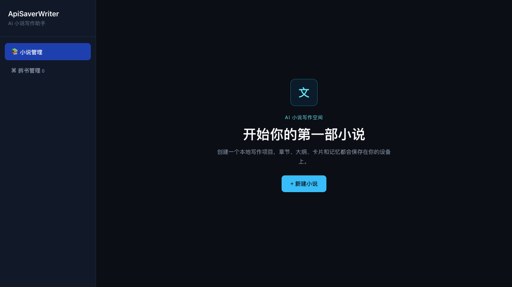
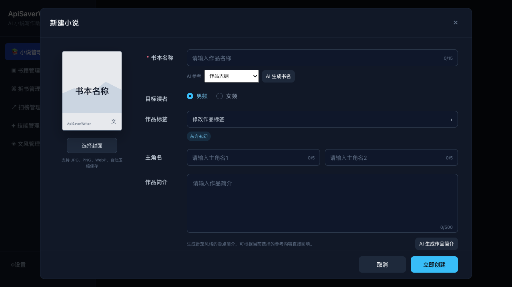

# AI写作软件｜AI写小说软件｜ApiSaverWriter

**关键词：AI写作软件、AI写小说软件、AI网文写作、小说智能体、长篇小说创作、网文大纲、章节记忆、Tauri 多端写作。**

> ApiSaverWriter 是一款面向长篇网文创作的 AI 写作软件、AI 写小说软件和本地优先写作工作台。

[](https://my.feishu.cn/wiki/TQKNwxbzUitID3kWxOicv58vnqa)
[](#下载安装)
[](LICENSE)

ApiSaverWriter 将作品资料、世界观、大纲、章节、角色卡、记忆与写作技能组织在一个本地项目中。它面向需要持续创作、追踪设定与维持上下文一致性的长篇网文作者，而不是一次性文本生成器。

## 下载安装

最新安装包、校验值与版本更新记录统一发布在飞书文档：

**[下载 ApiSaverWriter](https://my.feishu.cn/wiki/TQKNwxbzUitID3kWxOicv58vnqa)**

当前提供 macOS、Windows、Android 与 iOS 构建版本。iOS 安装包为未签名 IPA，需使用适合设备的签名或安装方式导入。

## 使用教程

完整的首次配置、模型选择、创建作品、章节写作、记忆维护、全文检索、拆书扫榜和百度网盘恢复流程，请查看飞书教程：

**[打开 ApiSaverWriter 使用教程](https://my.feishu.cn/wiki/UMTkwQAuEiIm3UkTNqrcAN3lnWb)**

教程会随着版本更新补充操作步骤和常见问题，README 只保留项目级说明。

## 联系与支持

- **官方 QQ 交流群：** [1019592334](https://qm.qq.com/q/Oc3ZAaU08K)
- **客服联系 QQ：** [2805099052](https://qm.qq.com/q/BJKvbHWSK4)

遇到安装、模型配置、写作记忆或同步问题，可以在群内反馈。请勿在公开 Issue 中发送 API Key、访问令牌、云端备份或个人小说内容。

## 核心能力

### 长篇创作工作流

- 创建和管理小说、卷、章节、总纲、章纲与世界观设定。
- 内置中文写作 Skills，覆盖总纲、章纲、世界观、正文、文风和拆书等场景。
- 章纲智能体识别“根据上一章生成下一章章纲”与“根据本章正文回溯章纲”等意图。
- 正文编辑器支持搜索替换、一键格式化、章节导入与更兼容的章节标题识别。

### 记忆、卡片与图谱

- 保存章节后提取并维护人物状态、角色认知、时间线、设定事实、伏笔、冲突和章末钩子。
- 固定世界观与作品设定自动参与创作上下文；总纲按工作流隔离，避免提前泄露后续剧情。
- 作品资料指纹、持久化上下文缓存、会话摘要与上下文裁剪降低重复加载成本。
- 卡片和知识图谱展示人物、设定与事件关系；切换节点时支持关联节点聚焦。

### 资料与研究

- 全文检索：在章节、纲要、卡片与项目资料中定位内容。
- 书籍搜索、下载、导入、拆书与多书源支持。
- 番茄、起点、飞卢等榜单采集与封面展示。

### 同步与多端

- 百度网盘完整备份与恢复，覆盖作品、记忆、大纲、卡片、拆书和扫榜资料。
- 支持在云端选择指定备份文件恢复。
- macOS、Windows、Android、iOS 统一通过应用内网盘 API 同步，不依赖本机 CLI 或桌面网盘客户端。

## 界面预览

以下截图来自 v0.1.4 的实际构建，用于展示主要工作流；移动端采用独立的窄屏布局。

| 首页 | 新建小说 |
| --- | --- |
|  |  |

### 移动端章节编辑器


## 使用方式

1. 在“设置”中添加 ApiSaver API Key，拉取该 Key 所属分组可用的模型并选择模型。
2. 新建小说，先建立世界观与作品设定，再创建总纲、章纲或正文。
3. 保存正文后确认章节记忆，后续章节会按固定资料、历史摘要与最近对话的顺序构建上下文。
4. 通过“设置 - 备份与同步”创建完整备份，在新设备上恢复同一份创作资料。

## 架构

```text
ApiSaverWriter/
├── desktop-app/             # React + TypeScript + Tauri 多端客户端
│   ├── src/                 # 界面、平台适配、内置 Skills
│   └── src-tauri/           # Rust 原生能力与移动端工程
├── sidecars/agent-runtime/  # Node.js 写作智能体、上下文和本地存储
├── src/                     # 技能、拆书、书源与基础能力
├── schema/                  # 本地数据结构
└── scripts/                 # 版本发布和飞书同步脚本
```

- **客户端**：React、TypeScript、Vite、Tauri 2。
- **智能体运行时**：Node.js、TypeScript，负责会话、上下文缓存、Skill 路由和章节记忆。
- **本地数据**：项目资料保存在用户设备本地；同步由用户主动触发。

## 本地开发

### 环境要求

- Node.js 20+
- Rust stable 与 Tauri 对应平台依赖
- 平台构建工具：Xcode（iOS/macOS）、Android SDK（Android）、Windows 构建环境（Windows）

### 启动

```bash
npm install
npm install --prefix desktop-app
npm run tauri:dev --prefix desktop-app
```

### 构建

```bash
npm run tauri:build --prefix desktop-app
```

移动端构建步骤请查看 [desktop-app/MOBILE.md](desktop-app/MOBILE.md)。

## 开源边界与隐私

本仓库公开的是客户端、写作工作流和本地数据能力。以下内容不在仓库内，也不会随客户端源码提交：

- ApiSaver 的模型渠道、模型路由、余额、计费、风控与运营系统。
- API Key、访问令牌、签名证书、个人小说内容、云端备份内容和其他用户数据。
- 生产服务配置与服务端密钥。

客户端默认使用 ApiSaver 服务地址，用户需在设置中配置自己的 API Key。请勿在 Issue、Pull Request、日志或截图中提交任何 Key、Cookie、备份文件或私密作品资料。

## 贡献

欢迎提交 Bug 报告、功能建议与 Pull Request。开始前请阅读 [贡献指南](CONTRIBUTING.md) 与 [安全策略](SECURITY.md)。

## 许可证

本项目以 [GNU Affero General Public License v3.0 or later](LICENSE) 发布。第三方依赖仍受各自许可证约束。
